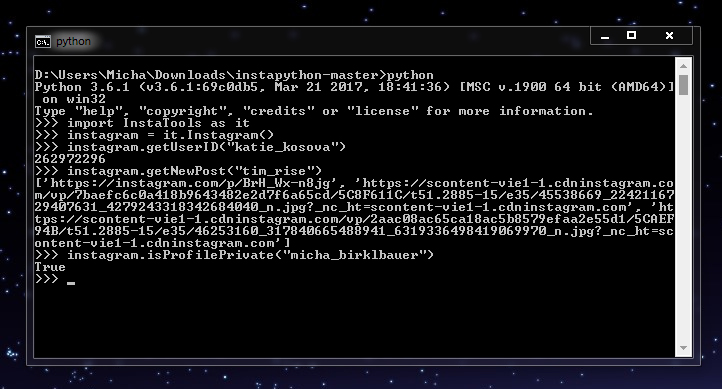
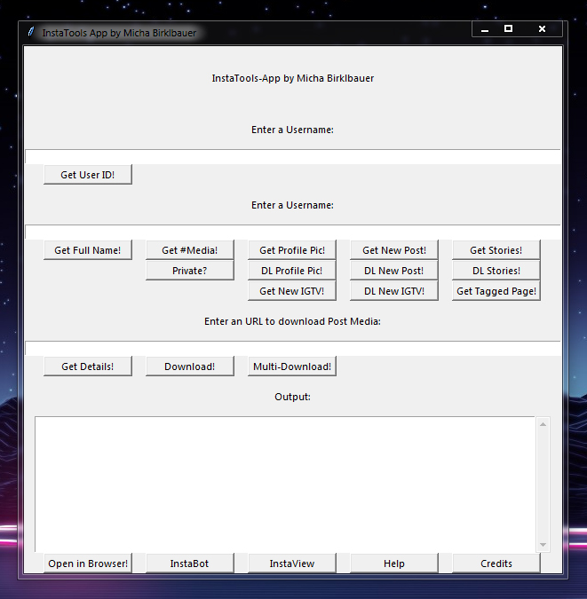

# InstaTools

A small python package to access and deal with Instagram data!

Sidenote: Yes, this is the follow-up to [InstaPython](https://github.com/t0xic-m/instapython)

# Screenshots





Yes, I know, the first line in the GUI is useless. I was too lazy to redesign though!

## Quick Start

Installation:

```bash
pip install Release/InstaTools-1.0.0.tar.gz
```

Import and Usage:

```python
import InstaTools
instagram = InstaTools.Instagram()
instagram.getUserID("katie_kosova")
262972296
````

## Classes and Functions

Read the ReadMe [here](https://github.com/t0xic-m/instatools/blob/master/README.md)

## Downloads

## License

[MIT License](https://github.com/t0xic-m/instatools/blob/master/LICENSE.md)

## Contact

- Website: [Web](https://t0xic-m.github.io/web)
- Website: [GitHub](https://t0xic-m.github.io)
- Mail: [Contact](mailto:micha.birklbauer@gmail.com)
